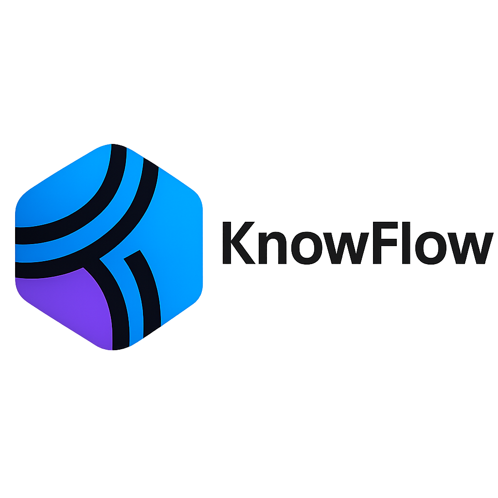
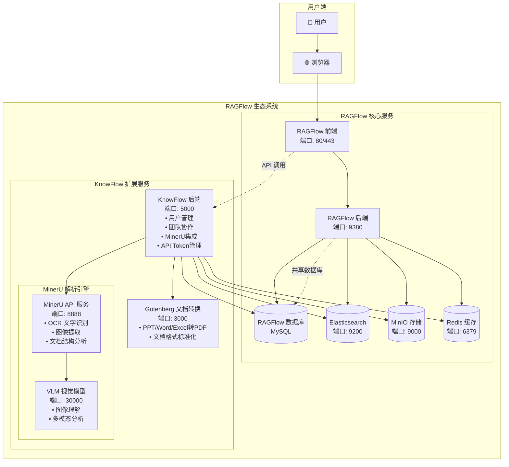
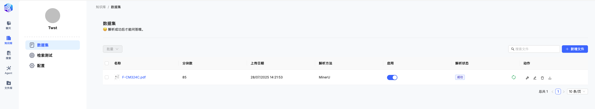
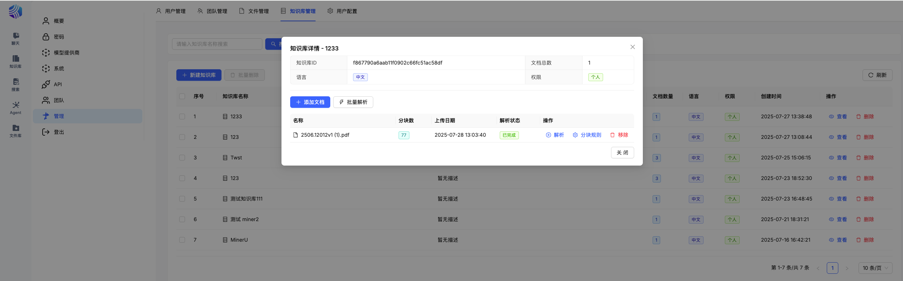
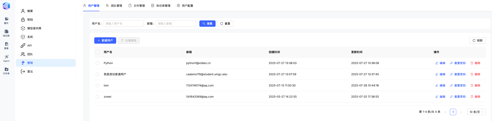
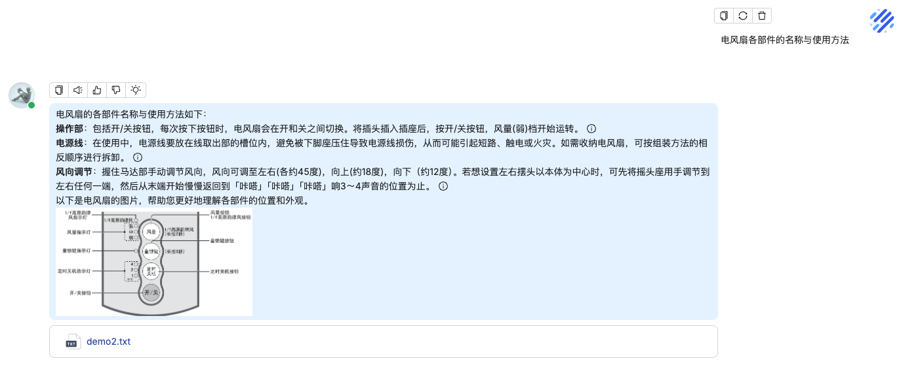
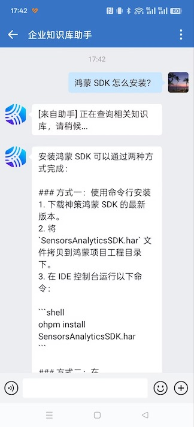

<div align="center">
  
</div>

# KnowFlow - 企业级智能知识库解决方案

[](https://star-history.com/#weizxfree/KnowFlow&Date)

🌐 **官方网站**: [https://weizxfree.github.io/KnowFlowSite/](https://weizxfree.github.io/KnowFlowSite/)

📺 **B站视频**: [https://www.bilibili.com/video/BV1Vfg8zDEUf/](https://www.bilibili.com/video/BV1Vfg8zDEUf/)

---

## 🚀 什么是 KnowFlow

**KnowFlow** 是一个基于 RAGFlow 的企业级开源知识库解决方案，专注于为企业提供真正落地的最后一公里服务。我们持续兼容 RAGFlow 官方版本，同时将社区最佳实践整合进来，为企业知识管理提供更加完善的解决方案。

### 🎯 产品定位

- **RAGFlow 企业落地的最后一公里**：解决从开源到生产的关键差距
- **插件化增强平台**：通过独立服务方式扩展 RAGFlow 功能
- **企业级知识管理系统**：提供完整的用户权限、团队协作、数据安全保障

### 🏗️ 系统架构

KnowFlow 采用分布式微服务架构，通过独立的服务组件为 RAGFlow 提供增强功能：



**架构特点：**
- **🔌 独立服务**：KnowFlow 作为独立微服务运行，不修改 RAGFlow 核心代码
- **🔗 API 集成**：通过 RESTful API 与 RAGFlow 前端无缝集成
- **💾 共享数据层**：复用 RAGFlow 的数据库、存储等基础设施
- **⚡ 高性能解析**：集成 MinerU 2.x 引擎，支持 GPU 加速
- **📄 格式转换**：内置 Gotenberg 服务，支持多种文档格式转换

### 💡 核心功能

<div align="center">

| 📚 **智能文档解析** | 🧠 **增强检索问答** | 👥 **企业级管理** | 🔌 **开放集成** |
|-------------------|-------------------|------------------|----------------|
| • MinerU2.x OCR引擎<br>• 图文混排输出<br>• 多种分块策略<br>• 20+文档格式支持 | • 精准语义检索<br>• 上下文感知问答<br>• 多模态内容理解<br>• 实时知识更新 | • 用户权限管理<br>• 团队协作空间<br>• 企业微信集成<br>• LDAP/SSO支持 | • 插件化架构<br>• API开放接口<br>• 自定义扩展<br>• 第三方系统集成 |

</div>


### 🌟 核心优势

<div align="center">

| 🌟 | **KnowFlow 优势** |
|----|-------------------|
| 🔌 | **插件化架构**：无缝兼容 RAGFlow 任意版本，所有增强均可热插拔，升级无忧 |
| 🏗️ | **微服务设计**：通过独立服务方式增强 RAGFlow，不修改核心代码 |
| 🧩 | **分块策略丰富**：支持多种分块算法，检索更精准，适配多场景文档 |
| 🏢 | **企业级特性**：MinerU2.x OCR 引擎、团队/用户/权限管理、企业微信、LDAP/SSO |
| 📈 | **最佳实践集成**：持续吸收社区优质方案，助力企业高效落地 |
| 🔧 | **简化部署**：一键安装脚本，Docker Compose 开箱即用 |

</div>


---

## 🚀 快速开始

### 方式一：Docker Compose 部署（推荐）

#### 前置要求
- Docker 20.10+ 
- Docker Compose 2.0+
- 至少 8GB 内存
- 可选：NVIDIA GPU + nvidia-container-toolkit（GPU加速）

#### 1. 启动 MinerU 服务

选择以下两种镜像之一：

**完整版（推荐）- 包含所有功能**
```bash
docker run --rm -d --gpus=all \
  --shm-size=32g \
  -p 8888:8888 -p 30000:30000 \
  --name mineru-api \
  zxwei/mineru-api-full:2.1.0
```

**基础版 - 仅包含基础功能**
```bash
docker run --rm -d --gpus=all \
  --shm-size=32g \
  -p 8888:8888 \
  --name mineru-api \
  zxwei/mineru-api:2.1.0
```

> 💡 **镜像说明：**
> - `zxwei/mineru-api-full`：包含完整的 VLM 功能，支持所有后端类型
> - `zxwei/mineru-api`：基础版本，主要支持 pipeline 后端
> - 如需 GPU 加速，请确保已安装 nvidia-container-toolkit

#### 2. MinerU 服务地址配置

在 `/knowflow/server/services/config/settings.yaml` 配置文件中，配置 MinerU 服务地址以及解析模式:

```bash
  fastapi:
    # FastAPI 服务地址
    # 本地开发: http://localhost:8888
    # Docker部署: http://host.docker.internal:8888 (Docker Desktop)
    #           或 http://宿主机IP:8888 (Linux Docker)
    url: "http://宿主机IP:8888"
    
    # HTTP 请求超时时间（秒）
    timeout: 30000


   # VLM 后端配置
  vlm:
    sglang:
      # SGLang 服务器地址（vlm-sglang-client 后端需要）
      # Docker部署时同样需要使用宿主机IP或容器网络地址
      server_url: "http://宿主机IP:30000"
```


#### 3. 启动容器，开始使用

进入到 `docker` 目录执行（此步骤和 RAGFlow 官方一致）：

```bash
docker compose up -d
```

访问地址：`http://服务器IP:80`，进入 KnowFlow 首页

### 方式二：源码部署


#### 前置要求
- Python 3.9+
- Node.js 16+ 
- pnpm
- MinerU 服务（参考上述步骤）

#### KnowFlow 后端部署

1. **安装 Python 依赖**
```bash
cd knowflow/server
python3 -m venv venv
source venv/bin/activate  # Windows: venv\Scripts\activate
pip install -r requirements.txt
```

2. **启动文件转换服务（可选）**
```bash
# 支持 PDF 以外文件格式需要启动此服务
docker run -d -p 3000:3000 gotenberg/gotenberg:8
```

3. **执行 install 脚本，初始化环境变量**

```bash
cd knowflow/
./scripts/install.sh --local
```

4. **启动 knowflow 后端服务**
```bash
python3 app.py
```

#### RAGFlow 后端部署

1. **修改 docker/entrypoint.sh 文件**
```bash
# 注释掉 nginx 行
# /usr/sbin/nginx
```

2. **激活 Python 虚拟环境**
```bash
source .venv/bin/activate
export PYTHONPATH=$(pwd)
```

3. **配置 HuggingFace 镜像（可选）**
```bash
# 如果无法访问 HuggingFace，设置镜像站点
export HF_ENDPOINT=https://hf-mirror.com
```

4. **检查配置文件**
确保 `conf/service_conf.yaml` 中所有主机和端口配置正确。

5. **启动后端服务**

方案一：

```bash
# 设置内存分配器和启动任务执行器
JEMALLOC_PATH=$(pkg-config --variable=libdir jemalloc)/libjemalloc.so
LD_PRELOAD=$JEMALLOC_PATH python rag/svr/task_executor.py 1

# 启动 API 服务器
python api/ragflow_server.py
```

方案二：

```bash
./local_entrypoint.sh
```


#### RAGFlow 前端部署

1. **安装 Node.js 依赖**
```bash
cd web
pnpm install
```

2. **启动开发服务器**
```bash
pnpm dev
```

浏览器访问启动后的地址，即可进入系统。

---

## 📋 功能详解

### 🎨 全新 UI 界面

基于 RAGFlow v0.19.0 二次开发，提供更加现代化的用户界面：

<div align="center">
  
</div>

<div align="center">
  
</div>

<div align="center">
  
</div>

### 👥 用户后台管理系统

管理员可以进行统一的管理：

<div align="center">
  
</div>


**核心特性：**
- 移除前端用户注册通道，管理员统一管理用户
- 用户管理、团队管理、模型配置管理
- 新用户自动加入创建时间最早用户的团队
- 继承团队模型配置，降低配置复杂度

### 📄 图文混排输出

**支持格式：** PPT、PNG、Word、DOC、Excel 等 20+ 种常见文件格式

**分块策略：**
1. **文档结构分块**：基于文档原生结构进行智能分块
2. **按标题分块**：根据标题层级自动划分内容块
3. **RAGFlow 原分块**：保持与官方完全一致的分块规则

<div align="center">
  
</div>

### 💼 企业微信集成

支持企业微信应用，可将企业微信作为聊天机器人入口：

<div align="center">
  
</div>

详细配置方式参照 `server/services/knowflow/README.md`

---

## ⚙️ 高级配置

### 🔧 MinerU 本地调试（开发环境）

如果需要在本地环境进行开发调试：

```bash
# 1. 安装 Python 依赖（注意：zsh 需要用引号包围方括号）
pip install "mineru[core]" fastapi uvicorn python-multipart

# 2. 设置环境变量
export MINERU_DEVICE_MODE=cpu
export MINERU_MODEL_SOURCE=modelscope

# 3. 进入项目目录
cd web_api

# 4. 启动本地服务
python app.py
```

**配置 settings.yaml：**

```yaml
mineru:
  fastapi:
    # 本地开发服务地址
    url: "http://localhost:8888"
  
  vlm:
    sglang:
      # 本地SGLang服务地址（如果使用vlm-sglang-client后端）
      server_url: "http://localhost:30000"
```


---

## 🔧 编译 Docker（开发者）


### 编译 KnowFlow-Server 镜像

```bash
# 后端镜像
docker buildx build --platform linux/amd64 --target backend -t zxwei/knowflow-server:v0.3.0 --push .

# 前端镜像
docker buildx build --platform linux/amd64 --target frontend -t zxwei/knowflow-web:v0.3.0 --push .
```

### 编译 KnowFlow 全镜像

```bash
# 安装 uv
sudo snap install astral-uv --classic
uv run download_deps.py
docker build -f Dockerfile.deps -t infiniflow/ragflow_deps .
docker build --build-arg LIGHTEN=1 -f Dockerfile -t infiniflow/ragflow:nightly-slim .

vim docker/.env 
RAGFLOW_IMAGE=infiniflow/ragflow:nightly-slim

```

---

## 开启管理员管理功能

默认注册的账号不具备管理员权限，如需使用管理功能，需要对账号进行授权。

运行 KnowFlow 之后，执行 `docker/set_superuser.sh` 脚本:

```bash
 ./set_superuser.sh set xxxx@xxx.com 
```

---

## 📋 TODO 清单

- [x] 支持更多文档格式的 MinerU 解析
- [x] 增强 MarkDown 文件的分块规则
- [x] 优化 Excel 文件分块
- [x] MinerU 2.0 接入
- [x] RAGFlow 前端 UI 源码开源
- [x] API Token 自动生成机制
- [ ] TextIn 接入
- [ ] MinerU 支持自动问题，自动关键词，Raptor，知识图谱 
- [ ] 多租户数据隔离
- [ ] 知识库版本管理
- [ ] 文档审批工作流

---

## ❓ 常见问题

### 1. 如何选择 MinerU 镜像版本？

**zxwei/mineru-api-full（推荐）：**
- 包含完整的 VLM 功能
- 支持所有后端类型：pipeline, vlm-transformers, vlm-sglang-engine, vlm-sglang-client
- 镜像较大，但功能最全

**zxwei/mineru-api：**
- 基础版本，镜像较小
- 主要支持 pipeline 后端
- 适合基础文档解析需求

### 2. 如何启用 GPU 加速？

1. **安装 nvidia-container-toolkit**
```bash
# 添加源
distribution=$(. /etc/os-release;echo $ID$VERSION_ID)
curl -s -L https://nvidia.github.io/libnvidia-container/gpgkey | sudo apt-key add -
curl -s -L https://nvidia.github.io/libnvidia-container/$distribution/libnvidia-container.list | \
  sudo tee /etc/apt/sources.list.d/nvidia-container-toolkit.list

# 安装组件
sudo apt-get update
sudo apt-get install -y nvidia-container-toolkit

# 重启 Docker
sudo systemctl restart docker
```

2. **启动容器时使用 GPU**
确保启动命令包含 `--gpus=all` 参数

3. **配置 GPU 后端**
```yaml
mineru:
  default_backend: "vlm-sglang-client"  # 使用 VLM 后端
```

### 3. 常见错误处理

**端口冲突：**
- MinerU 服务：8888, 30000
- KnowFlow 前端：8081
- 后端服务：5000
- 确保端口未被占用

**内存不足：**
增加 Docker 内存限制或调整 `--shm-size` 参数

**网络连接问题：**
检查防火墙设置和容器网络配置

**图片显示问题：**
确保聊天助手提示词包含图片显示指令：

> 请参考{knowledge}内容回答用户问题。<br>
> 如果知识库内容包含图片，请在回答中包含图片URL。<br>
> 注意这个 html 格式的 URL 是来自知识库本身，URL 不能做任何改动。<br>
> 请确保回答简洁、专业，将图片自然地融入回答内容中。

---


## 📄 许可证

**KnowFlow** 采用 [GNU Affero General Public License v3.0 (AGPL-3.0)](LICENSE) 开源许可证。

### ✅ 您可以自由地：
- **使用**：个人学习、研究、开发和部署
- **修改**：根据需要修改源代码  
- **分发**：分享给他人使用
- **贡献**：提交 PR 和 Issue，参与开源协作

### ⚠️ 重要限制条件：
- **源码开放**：如果您修改了 KnowFlow 并通过网络提供服务，必须向用户提供修改后的完整源代码
- **相同许可**：基于 KnowFlow 的衍生作品必须同样采用 AGPL-3.0 许可证
- **版权保留**：保留原始版权声明和许可证信息

### 🏢 商业使用说明
AGPL-3.0 允许商业使用，但有重要约束：
- 如果您将修改版本作为网络服务提供，必须开源所有修改
- 如果这不符合您的商业需求，请联系获取商业许可

### 📞 商业许可咨询
- 💬 微信：skycode007（备注"商业授权咨询"）

> **注意**：AGPL-3.0 是一个严格的 copyleft 许可证，特别适用于网络服务。使用前请仔细阅读 [完整许可证条款](LICENSE)。


---

## 🤝 社区与支持

### 💬 交流群

如有需求或问题建议，可加入交流群讨论。

加微信 `skycode007`，备注"加群"即可。

### 📢 更新信息

项目持续更新中，更新日志会在微信公众号 **[KnowFlow 企业知识库]** 发布，欢迎关注。

### 🙏 鸣谢

本项目基于以下开源项目开发：

- [ragflow](https://github.com/infiniflow/ragflow) - 核心 RAG 框架

---

<div align="center">
  <p>⭐ 如果这个项目对您有帮助，请不要忘记点个 Star！</p>
  <p>🚀 让我们一起构建更好的企业知识库解决方案！</p>
</div>