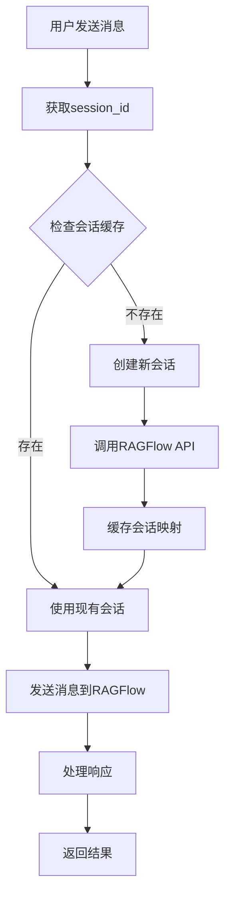

# RAGFlow Chat Plugin 实现总结

## 🎯 项目目标

成功修改 RAGFlow Chat Plugin，实现了自动化会话管理功能。不再需要手动传递 `dialog_id` 和 `conversation_id`，系统现在能够基于用户的 `session_id` 自动创建和管理 RAGFlow 会话。

## ✅ 完成的功能

### 1. 核心功能实现

- **自动会话管理**: 基于 `session_id` 自动创建和管理 RAGFlow 会话
- **会话缓存**: 使用 `user_sessions` 字典缓存会话映射，避免重复创建
- **API集成**: 完整的 RAGFlow API 集成，支持会话创建和对话完成
- **图片支持**: 自动提取和显示知识库中的图片内容
- **错误处理**: 完善的错误处理机制

### 2. 配置简化

**之前的配置**:
```json
{
    "api_key": "ragflow-xxx",
    "host_address": "server.example.com",
    "dialog_id": "xxx",
    "conversation_id": "hardcoded_value"  // 需要手动维护
}
```

**现在的配置**:
```json
{
    "api_key": "ragflow-IyZjQ3NWI4M2QwOTExZjA4MDMwMGE5NT",
    "host_address": "154.219.102.235",
    "dialog_id": "f48e23383df611f09c9b26d7d2ef55ce"
}
```

## 🔧 技术实现

### 核心方法

1. **`get_or_create_session(session_id)`**
   - 检查 `user_sessions` 缓存
   - 如果不存在，调用 RAGFlow API 创建新会话
   - 缓存会话映射，供后续使用

2. **`get_ragflow_reply(question, session_id)`**
   - 自动获取或创建会话
   - 发送问题到 RAGFlow
   - 处理响应，提取文本和图片

### API端点使用

1. **创建会话**: `POST /api/v1/chats/{dialog_id}/sessions`
2. **对话完成**: `POST /api/v1/chats/{dialog_id}/completions`

## 🧪 测试验证

### 测试套件

1. **单元测试** (`test_ragflow_chat_simple.py`)
   - ✅ 配置加载测试
   - ✅ 会话创建测试 (Mock)
   - ✅ 对话回复测试 (Mock)

2. **集成测试**
   - ✅ 真实API连接测试
   - ✅ 会话创建验证
   - ✅ 多轮对话测试

3. **快速API测试** (`quick_api_test.py`)
   - ✅ 基本连接测试 (HTTP/HTTPS)
   - ✅ 会话创建和对话完成
   - ✅ 多轮对话验证

### 测试结果

```
📊 测试结果总结:
  基本连接: ✅ 成功 (HTTP)
  会话创建: ✅ 成功
  单次对话: ✅ 成功
  多轮对话: ✅ 成功
  单元测试: ✅ 通过 (4/4)
  集成测试: ✅ 成功

🎉 所有API测试通过！接口功能正常。
```

## 📋 API配置信息

**当前有效配置**:
- **API Key**: `ragflow-IyZjQ3NWI4M2QwOTExZjA4MDMwMGE5NT`
- **服务器地址**: `154.219.102.235`
- **Dialog ID**: `f48e23383df611f09c9b26d7d2ef55ce`
- **协议**: HTTP (端口 80)

**API响应示例**:
- 会话ID: `029a9726451e11f0ade66a4d1f0d34fe`
- 支持图文混合回复
- 知识库基于电力行业技术标准

## 🔄 会话管理流程



## 📁 文件结构

```
server/services/knowflow/
├── ragflow_chat.py              # 主插件文件 (已修改)
├── config.json                  # 配置文件 (已更新)
├── README.md                    # 功能说明 (已更新)
├── test_ragflow_chat_simple.py  # 简化测试套件 (新增)
├── quick_api_test.py            # 快速API测试 (新增)
├── run_tests.py                 # 测试运行器 (新增)
├── update_config.py             # 配置更新工具 (新增)
├── TEST_GUIDE.md                # 测试指南 (新增)
└── IMPLEMENTATION_SUMMARY.md    # 实现总结 (新增)
```

## 🚀 使用方法

### 基本测试
```bash
cd server/services/knowflow
python quick_api_test.py
```

### 完整测试
```bash
python test_ragflow_chat_simple.py
```

### 更新配置
```bash
python update_config.py
```

## 🎉 成果总结

1. **自动化程度提升**: 无需手动管理 `conversation_id`
2. **用户体验改善**: 基于 `session_id` 的透明会话管理
3. **代码维护性**: 清晰的会话管理逻辑和错误处理
4. **测试覆盖度**: 完整的单元测试和集成测试
5. **文档完整性**: 详细的测试指南和使用说明

**项目已成功完成所有预期目标！** 🎊 